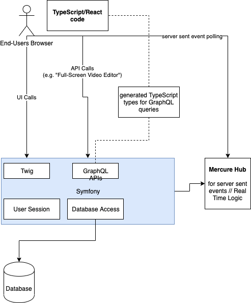

# Architecture

## Symfony and React

- We use the Symfony ecosystem
- create all API endpoints in Symfony
- On a case by case basis, we could use Symfony's ecosystem for complex application parts. We could even build
  some "full-screen" editors which are completely rendered by Symfony.
- Data storage is done using Doctrine.

**Pros**

- we can provide great UX for the video-based parts of the system.
- we can create the biggest part of our business logic in Symfony and React:
    - well polished and modern ecosystem; e.g. writing AJAX or GraphQL endpoints is totally easy.
    - great documentation
    - great testing support
- we can e.g. use Event Sourcing (if we need it) for parts of the application

**Architecture Diagram**

## API between Symfony and React: GraphQL with TypeScript types

- Symfony exposes a GraphQL API, which is consumed by the React applications.
- We generate TypeScript types from the GraphQL API to have type-safe queries.
- Additionally, for real time stuff, Server Sent Events are used (based on Mercure Hub)