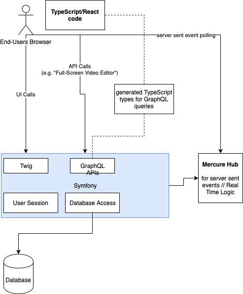

# Architecture: ILIAS vs Symfony vs React

## Idea 1: go ILIAS-Native, Symfony only as CLI

We do as much as possible in ILIAS. This means, we write custom ILIAS plugins for all our functionality,
and try to be "nice citizens" in the ILIAS ecosystem. 

**Why do we need Symfony at all then?**

We don't really. Problem is that ILIAS does not provide a CLI (except for the Setup since ILIAS 6), and no way to
register custom CLI commands.

Thus, for instrumenting our ILIAS installation, we created a small Symfony CLI application - but we could also do this
with plain PHP.

**Pros**

- created plugins are installable in all other kinds of ILIAS instances.

**Cons** 

- No standardized way how to do testing in ILIAS plugins
- We have to do everything "the ILIAS way", which, in terms of code style, is not really modern (yet). So this
  means we do not really use MVC, we cannot use Doctrine (but we have to use some custom-implemented ILIAS ActiveRecord
  base classes).
- No clear way e.g. how to write AJAX endpoints (though this is solveable, as ILIAS is using AJAX internally).
- Not much good documentation on how to write Plugins.
- UI-wise, we would be quite constrained to build everything using the ILIAS look and feel; which still feels like
  a professional, but not-so-sexy web platform.

## Idea 2: ILIAS Plugins, embedded React Application

For stuff like video editing or even video annotation, we prefer a very **rich** set of UI controls and we want
full control over the UX.

That's why we probably create a React application which both covers the experience for the Creator of the course,
as well as the experience for the end-user doing the course.

**Pros**

- created plugins are installable in all other kinds of ILIAS instances.
- we can provide great UX for the video-based parts of the system.

**Cons** 

- No standardized way how to do testing in ILIAS plugins
- server-side, we have to do everything "the ILIAS way", which, in terms of code style, is not really modern (yet). So this
  means we do not really use MVC, we cannot use Doctrine (but we have to use some custom-implemented ILIAS ActiveRecord
  base classes).
- No clear way e.g. how to write AJAX endpoints (though this is solveable, as ILIAS is using AJAX internally).
- Not much good documentation on how to write Plugins.

## Idea 3: minimal ILIAS Plugins, embedded React Application, Symfony API endpoints

- Let's expose our Symfony CLI Application from Idea 1 to the web
- create all API endpoints in Symfony
- The Symfony code can still use ILIAS functionality internally, but well-encapsulated anyways.
- On a case by case basis, we could use Symfony's ecosystem for complex application parts. We could even build
  some "full-screen" editors which are completely rendered by Symfony.
- Data storage could be done in the ILIAS tables, BUT we could also leverage Doctrine if we want to for some parts.

**Class Loading**

For the Symfony Application, we have to use Symfony's autoloader first, and then use the ILIAS autoloader as a fallback.

This way, we ensure Symfony works as intended; and we *might* encounter problems when calling some ILIAS functionality.
However, from within the Symfony application, we will only call a small part of the ILIAS APIs; so this tradeoff seems
fine so far.

**Shared Authentication**

We need to be able to ask whether an ILIAS user is currently logged in (and who) from within the Symfony Application.

This works by the following steps:

- ensure ILIAS and Symfony are served on the same domain; Symfony being served in a subdirectory (DONE).
- ensure the PHP Session cookie (PHPSESSID) is set for the "/" path, so it is shared under all circumstances
  between ILIAS and Symfony (SOLVED in IliasLoader).
- Disable Symfony's own session (DONE).
- In case of being not logged in, we need to redirect the user to Ilias  (from Symfony) (DONE using a custom Symfony route).
- Ask Ilias PHP code from within Symfony for current user (DONE).

**NOTE:** If we would not use PHP, but e.g. Go or another language for the Companion Application, this "cross-call" directly
into the ILIAS application would not be possible. **This is the main reason why we should use PHP in the full platform,
as it keeps the barrier between the different parts very low.** 

**Pros**

- we can provide great UX for the video-based parts of the system.
- we can create the biggest part of our business logic in Symfony:
    - well polished and modern ecosystem; e.g. writing AJAX or GraphQL endpoints is totally easy.
    - great documentation
    - great testing support
- we can e.g. use Event Sourcing (if we need it) for parts of the application
- Symfony can still use every ILIAS class and call into internal APIs easily.

**Cons** 

- the solution is more complex, because of two different entrypoints.
- the solution is not shippable as ILIAS plugins only, but needs more special setup.
- From within custom ILIAS plugins, it will NOT be possible to call back to Symfony.

**Architecture Diagram**

