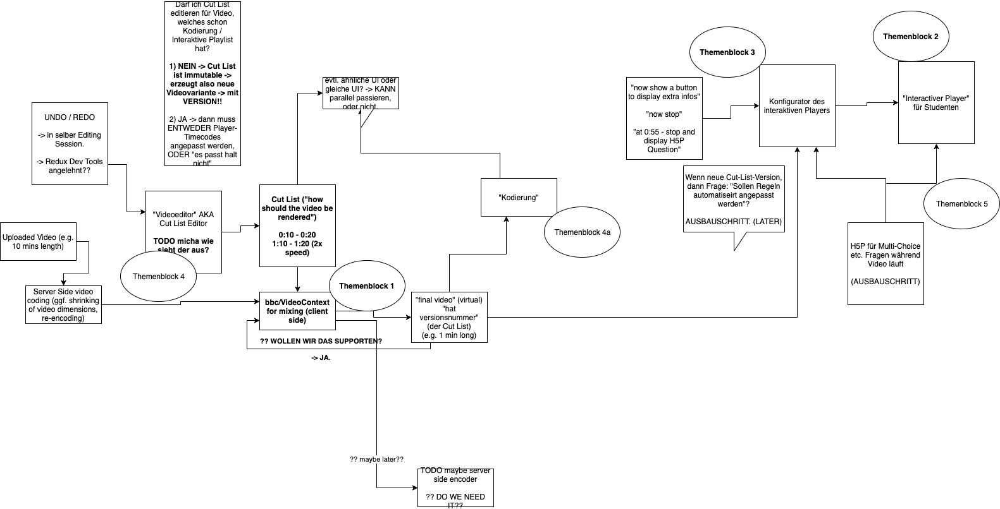

# Frontend / Video Architecture

## Libraries

**Video Editor React**

- build from scratch using https://react-dnd.github.io/react-dnd/about ?
- simple cropper https://github.com/evgenity/react-html5-video-editor
- Timeline
    - https://github.com/namespace-ee/react-calendar-timeline
    - https://github.com/guiqui/react-timeline-gantt
    - (eher nicht) https://visjs.github.io/vis-timeline/examples/timeline/editing/individualEditableItems.html
    - https://github.com/JSainsburyPLC/react-timelines
        - kein Editing?
    - for inspiration: https://github.com/kevintech/timeline-editor-react
    - https://daybrush.com/scenejs/features.html#timeline ??
        - https://github.com/daybrush/scenejs-timeline !! nice
            - !!!!!!!!!!!! hier scheint React code im bauch zu sein: https://github.com/daybrush/scenejs-timeline/tree/master/packages/react-scenejs-timeline/src/react-scenejs-timeline
    

**Video Editing Core**

!!! https://github.com/bbc/VideoContext#videonode

https://github.com/ThreadsStyling/video-renderer
https://github.com/clabe45/vidar
https://github.com/bbc/digital-paper-edit-client/blob/master/docs/intro.md

https://github.com/OpenHypervideo/FrameTrail

**Undo / Redo**

https://github.com/omnidan/redux-undo
